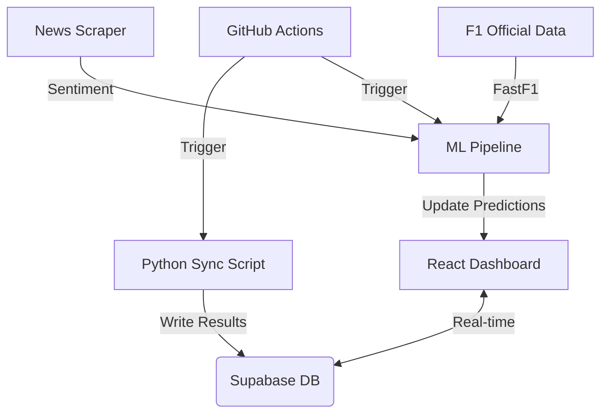

# 🏗️ F1 2026 Predictions Architecture

This document outlines the technical architecture, data flow, and machine learning pipeline of the F1 2026 Predictions platform.

## 📡 System Overview

The application is a distributed system comprising a **React Frontend**, a **Supabase Backend-as-a-Service**, and an **Automated Python ML Pipeline**.



---

## 🏎️ Machine Learning Pipeline

The core intelligence resides in `ml/`, utilizing a tiered training approach.

### 1. Feature Engineering (`ml/features/`)
We transform historical F1 data (2018–2025) into training sets, enriched with 2026-specific variables:
- **Regulation Impact**: A hardcoded disruption score in `config.py` that offsets historical team dominance to account for the 2026 "Clean Slate" regulations.
- **News Sentiment**: Real-time sentiment analysis from Google News RSS feeds, capturing team momentum and "Paddock chatter".
- **Rolling Form**: Dynamic tracking of wins, podiums, and qualifying performance throughout the active 2026 season.

### 2. Model Training (`ml/train.py`)
We use **Gradient Boosting Classifiers** (Scikit-Learn) to handle the non-linear nature of racing performance:
- **Race Winner Model**: Predicts the probability of each constructor winning a specific round.
- **Podium Model**: Multi-output classifier for P1, P2, and P3 spots.
- **Championship Model**: Regression-based prediction of total season points.

### 3. Prediction Export (`ml/export_predictions.py`)
Models are exported as `.joblib` files. The export script runs simulations for all remaining 2026 rounds and generates `public/ml-predictions.json`, which the frontend consumes as a static asset for extreme performance.

---

## 🦾 Automation & Sync (`sync_results.py`)

The "Race Control" layer ensures the dashboard matches reality.
- **Supabase Integration**: Python scripts use the `supabase-py` client to push race outcomes and update the global leaderboard.
- **Real-time Engine**: The React frontend subscribes to the `actual_results` table via Supabase Channels, enabling "Zero-Refresh" updates when a race winner is declared.
- **Scoring Logic**: Automates point distribution to users based on their submitted predictions (Race, Qualy, Sprint, and Team winners).

---

## 🧪 Quality Assurance

### End-to-End Testing
We use **Playwright** to verify the entire user journey:
- **UI Integrity**: Ensures all dashboard sections (Hero, Calendar, Standings) render correctly.
- **Real-time Data Flow**: Verifies that Supabase-fetched results are mapped correctly to the UI.
- **Regression Testing**: Automatically runs before every GitHub push to ensure new ML models haven't broken the frontend.

---

## 📂 Project Structure

```text
├── .github/workflows/    # CI/CD (Automation + CI)
├── ml/                   # Machine Learning Pipeline
│   ├── data/             # Historical Raw Data
│   ├── features/         # Feature Engineering Logic
│   ├── models/           # Trained .joblib artifacts
│   └── processed/        # Interim JSON features (Sentiment, etc.)
├── public/               # Static Assets & ML Exports
├── src/                  # React Application
│   ├── components/       # UI Components
│   └── utils/            # Supabase & Helper functions
└── tests/                # Playwright E2E Tests
```
