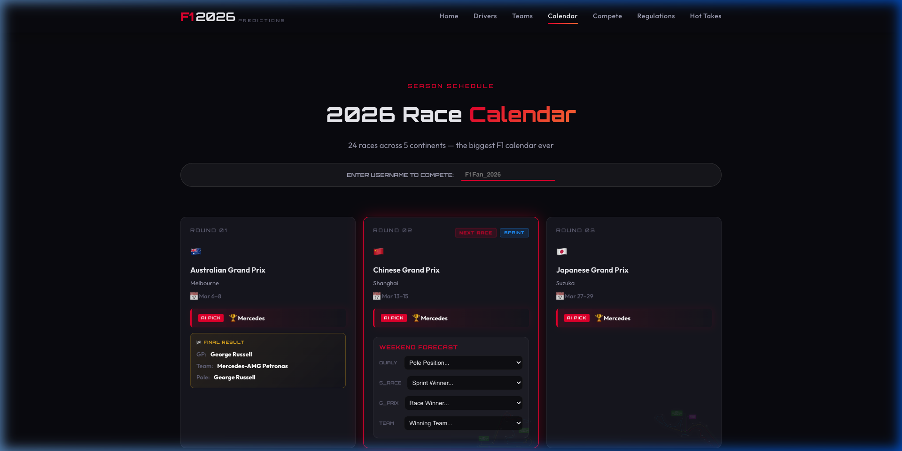
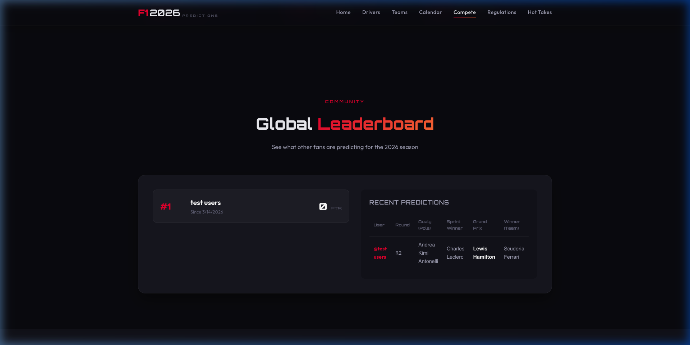

# 🏁 F1 2026 Prediction Leaderboard

A premium, real-time prediction platform for the 2026 Formula 1 season. Built for fans who want to challenge machine intelligence and compete globally.

 


## 📸 Screenshots

<p align="center">
  
  <br>
  <em>Interactive Race Calendar with AI Predictions and User Entry</em>
</p>

<p align="center">
  
  <br>
  <em>Global Leaderboard with Real-time Prediction Tracking</em>
</p>

## ✨ Features

- 🏎️ **Live Race Calendar**: Full 24-round 2026 schedule with smart detection for **Sprint Weekends**.
- 🤖 **AI Forecasting**: Integrated ML-driven race winner predictions to challenge your racing intuition.
- 🏆 **Global Leaderboard**: Real-time scoring system powered by Supabase. Points for Qualy (5), Sprint (10), Race (25), and Team (10).
- ⚡ **Real-time Sync**: Instant UI updates across all active users whenever results or predictions are posted.
- 🦾 **Race Control Automation**: Automated result publishing via GitHub Actions and scheduled Python sync scripts.
- 🎨 **Premium Dark UI**: High-tech "Paddock" aesthetics with smooth animations and mobile-responsive layout.

---

## 🚀 Tech Stack

- **Frontend**: React 18, Vite, Framer Motion, Material UI (Notifications)
- **Backend**: Supabase (PostgreSQL, Real-time Channels, RLS)
- **Automation**: Python 3.10+, GitHub Actions
- **Styling**: Modern CSS Design Systems

---

## 🛠️ Getting Started

### 1. Clone & Install
```bash
git clone https://github.com/virat07/f1-2026-predictions.git
cd f1-2026-predictions
npm install
```

### 2. Supabase Configuration
Create a `.env` file or update `src/utils/supabaseClient.js`:
```javascript
VITE_SUPABASE_URL=your_project_url
VITE_SUPABASE_ANON_KEY=your_anon_key
```
> [!IMPORTANT]
> Detailed SQL schema and RLS policies are located in [README_SUPABASE.md](./README_SUPABASE.md).

### 3. Start Development
```bash
npm run dev
```

---

## 🤖 Race Control (Automation)

The project includes a `sync_results.py` script to automate result publishing and leaderboard scoring.

#### Watch Mode (Local)
Keep the script running to automatically publish results based on race end-times:
```bash
python3 sync_results.py --watch
```

#### GitHub Actions (Cloud)
The repository is configured with a GitHub Action (`.github/workflows/f1-sync.yml`) that automatically runs the sync script every race Sunday.

---

## 📊 Scoring System

| Achievement | Points |
| :--- | :--- |
| **Correct Pole (Qualy)** | 5 pts |
| **Correct Sprint Winner** | 10 pts |
| **Correct GP Winner** | 25 pts |
| **Correct Team Winner** | 10 pts |

---

## 📜 License
MIT © [Virat07](https://github.com/virat07)

---
*Developed for the next generation of Formula 1 fans. 🏎️💨*
