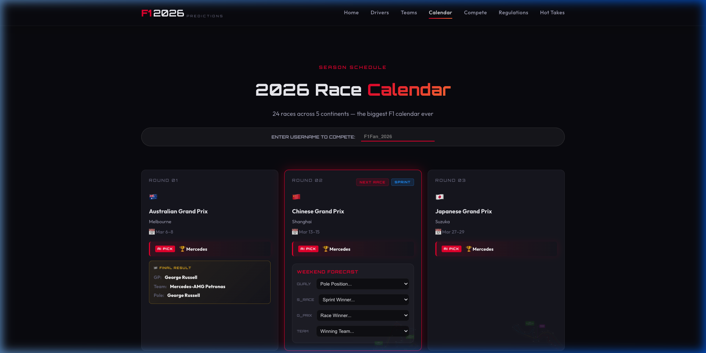

# 🏁 F1 2026 Prediction Leaderboard

A premium, real-time prediction platform for the 2026 Formula 1 season. Built for fans who want to challenge machine intelligence and compete globally.

 


## 📸 Screenshots

<p align="center">
  
  <br>
  <em>Interactive Race Calendar with AI Predictions and User Entry</em>
</p>

## ✨ Features

- 🏎️ **Live Race Calendar**: Full 24-round 2026 schedule with smart detection for **Sprint Weekends**.
- 🤖 **Regulation-Aware AI**: Integrated ML models that account for the 2026 technical reset (Active Aero, 50/50 PU split).
- 🏆 **Global Leaderboard**: Real-time scoring system powered by Supabase. Points for Qualy, Sprint, Race, and Team.
- ⚡ **Real-time Sync**: Instant UI updates across all active users whenever results or predictions are posted.
- 🦾 **E2E Testing**: Comprehensive [Playwright](https://playwright.dev/) test suite integrated into the CI/CD pipeline.
- 🎨 **Premium Dark UI**: High-tech "Paddock" aesthetics with smooth animations and mobile-responsive layout.

---

## 🏗️ Architecture

For a deep dive into the system design, ML pipeline, and automation flow, check out our [**Architecture Guide (ARCHITECTURE.md)**](./ARCHITECTURE.md).

---

## 🚀 Tech Stack

- **Frontend**: React 18, Vite, Framer Motion, Material UI
- **Backend / DB**: Supabase (PostgreSQL + Real-time + RLS)
- **Machine Learning**: Python (Scikit-Learn, Pandas, FastF1)
- **CI/CD & Automation**: GitHub Actions, Playwright E2E
- **Data Scraping**: Node.js (Playwright) + Python (RSS Sentiment)

---

## 🛠️ Getting Started

### 1. Clone & Install
```bash
git clone https://github.com/virat07/f1-2026-predictions.git
cd f1-2026-predictions
npm install
```

### 2. Run Tests
Ensure the application is stable before deploying:
```bash
npx playwright install
npm run test
```

### 3. Start Development
```bash
npm run dev
```

---

## 🤖 Race Control (Automation)

The project includes a `sync_results.py` script to automate result publishing and leaderboard scoring.

#### Watch Mode (Local)
Keep the script running to automatically publish results based on race end-times:
```bash
python3 sync_results.py --watch
```

#### GitHub Actions (Cloud)
The repository is configured with a single, consolidated GitHub Action (`.github/workflows/f1-automation.yml`) that handles:
1. **Model Retraining**: Updating predictions based on latest race outcomes.
2. **Result Sync**: Pushing official winners to Supabase via `sync_results.py`.
3. **E2E Verification**: Running Playwright tests to ensure UI integrity after every update.

---

## 📈 ML Pipeline

Predictions are generated by Gradient Boosting models trained on historical F1 data, enriched with:
- **Regulation Impact Scores**: Hardcoded offsets for the 2026 rule changes.
- **News Sentiment**: Real-time sentiment analysis of F1 media headlines.

---

## 📜 License
MIT © [Virat07](https://github.com/virat07)

---
*Developed for the next generation of Formula 1 fans. 🏎️💨*
